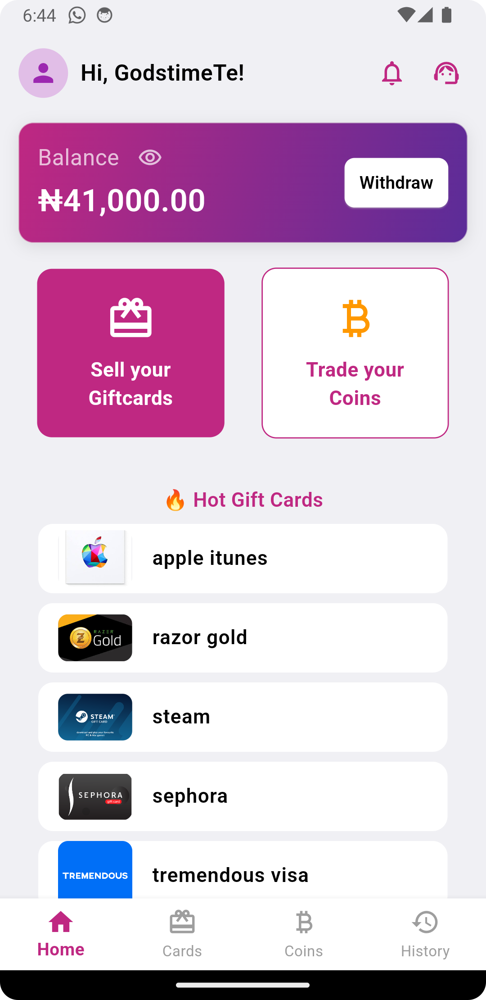
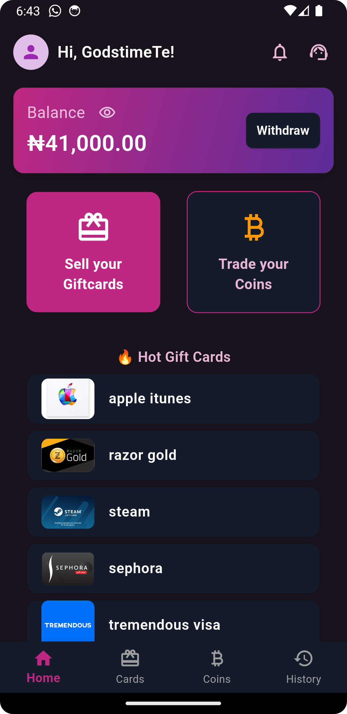
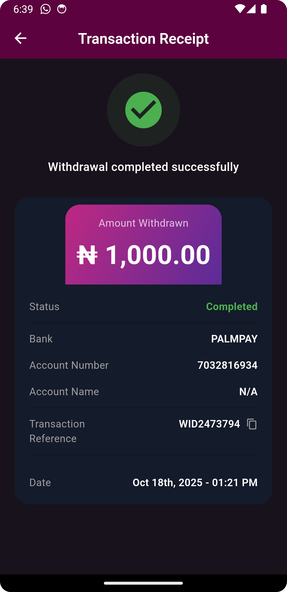
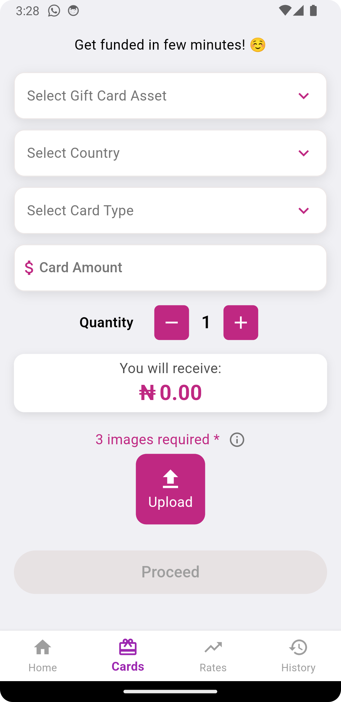
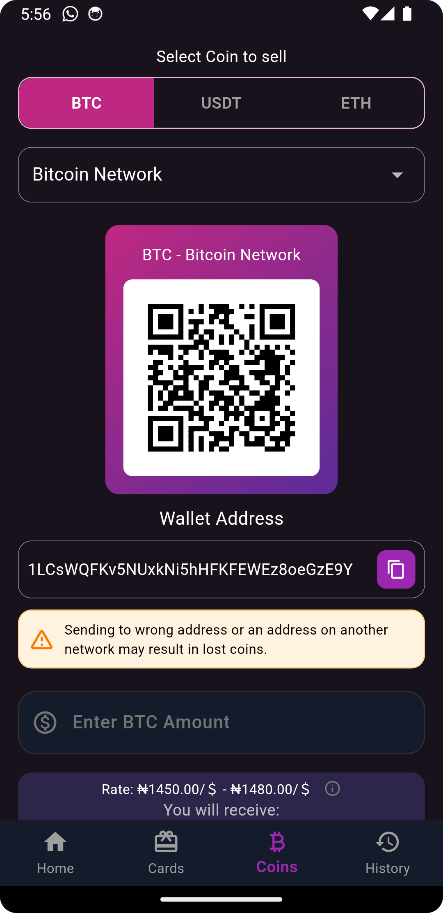
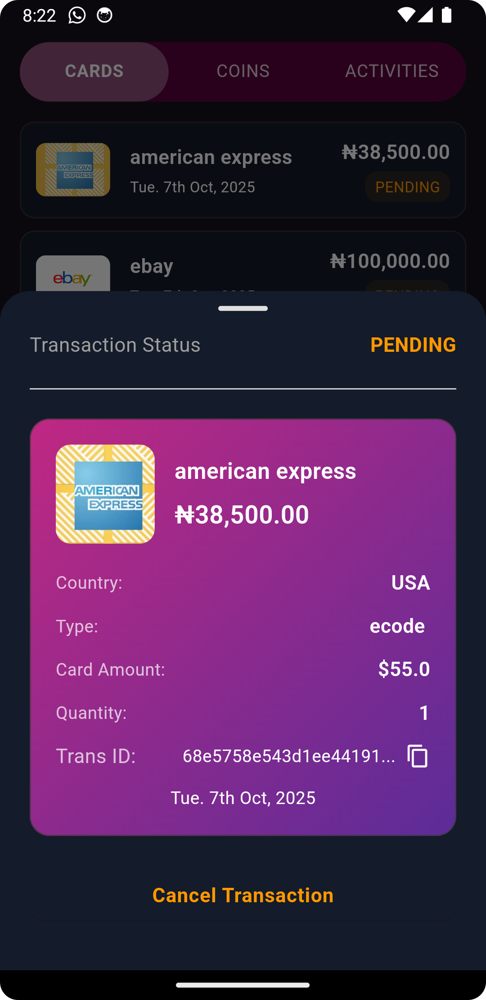

# Legit Cards

A Flutter-based mobile application for trading gift cards and cryptocurrencies. Legit Cards provides a seamless platform for users to sell their gift cards and trade cryptocurrencies with real-time exchange rates and secure transactions.

## Screenshots

### Home Screen (Light & Dark Mode)
<p float="left">
  
  
</p>

The home screen displays your current balance, quick access to withdraw funds, and options to sell gift cards or trade cryptocurrencies. Features a "Hot Gift Cards" section showcasing popular brands like Apple iTunes, Razor Gold, Steam, Sephora, and Tremendous Visa.

### Transaction Receipt


View detailed transaction receipts including:
- Transaction status (Pending/Completed)
- Amount withdrawn
- Bank details
- Account information
- Transaction reference number
- Date and time

### Sell Gift Cards


Intuitive interface for selling gift cards:
- Select from multiple gift card brands
- Choose country and card type
- Enter card amount and quantity
- Upload up to 3 card images for verification
- Real-time calculation of amount to receive

### Trade Cryptocurrencies


Trade Bitcoin, USDT, and Ethereum:
- Multiple cryptocurrency support (BTC, USDT, ETH)
- Network selection (Bitcoin Network, etc.)
- QR code for quick wallet address scanning
- Real-time exchange rates
- Secure wallet address display

### Transaction History


Track all your transactions:
- View cards, funds, and activity history
- Status indicators (Pending/Completed)
- Transaction amounts in Naira
- Date tracking for all transactions

## Features

- **Gift Card Trading**: Sell gift cards from popular brands (Apple iTunes, Amazon, Steam, Sephora, Razor Gold, Tremendous Visa, and more)
- **Cryptocurrency Trading**: Trade Bitcoin (BTC), USDT, and Ethereum (ETH) with real-time exchange rates
- **Wallet Management**: Track your balance and withdraw funds easily
- **Transaction History**: View detailed history of all cards, funds, and activities
- **Secure Transactions**: All transactions are processed securely with transaction references
- **Dark Mode Support**: Full dark mode support for comfortable viewing
- **Push Notifications**: Stay updated with transaction status and app updates
- **Image Upload**: Upload gift card images directly from your device
- **QR Code Support**: Quick wallet address sharing via QR codes
- **Real-time Rates**: Live exchange rates for cryptocurrency trading
- **Multiple Payment Methods**: Support for various Nigerian banks and payment services

## Tech Stack

### Framework
- **Flutter SDK**: ^3.5.4
- **Dart**: Latest stable version

### State Management
- **Provider**: ^6.1.2

### Navigation
- **go_router**: ^14.8.1

### Backend & Authentication
- **Firebase Core**: ^3.6.0
- **Firebase Auth**: ^5.3.0
- **Firebase Database**: ^11.0.0 (Realtime Database)
- **Firebase Messaging**: ^15.1.3 (Push Notifications)

### Networking
- **http**: ^1.2.2

### Image Handling
- **image_picker**: ^1.0.7
- **flutter_image_compress**: ^2.3.0
- **cached_network_image**: ^3.3.1
- **cloudinary_public**: ^0.23.1

### Storage & Security
- **shared_preferences**: ^2.0.0
- **flutter_secure_storage**: ^8.0.0
- **encrypt**: ^5.0.0

### UI Components
- **flutter_svg**: ^2.0.9
- **qr_flutter**: ^4.1.0
- **pin_code_fields**: ^8.0.1
- **fluttertoast**: ^8.2.8
- **modal_progress_hud_nsn**: ^0.5.1

### Utilities
- **device_info_plus**: ^10.1.0
- **permission_handler**: ^11.3.0
- **path_provider**: ^2.1.2
- **url_launcher**: ^6.3.0
- **awesome_notifications**: ^0.9.3

## Getting Started

### Prerequisites

- Flutter SDK (^3.5.4 or later)
- Dart SDK
- Android Studio / Xcode
- Firebase account
- Git

### Installation

1. **Clone the repository**
   ```bash
   git clone https://github.com/etineh/Legitcards-user-app
   cd legit_cards
   ```

2. **Install dependencies**
   ```bash
   flutter pub get
   ```

3. **Configure Firebase**
   - Create a new Firebase project at [Firebase Console](https://console.firebase.google.com/)
   - Add Android and iOS apps to your Firebase project
   - Download `google-services.json` (Android) and place it in `android/app/`
   - Download `GoogleService-Info.plist` (iOS) and place it in `ios/Runner/`
   - Enable Firebase Authentication, Realtime Database, and Cloud Messaging

4. **Configure Cloudinary** (for image uploads)
   - Create a Cloudinary account
   - Add your Cloudinary credentials to the app configuration

5. **Run the app**
   ```bash
   # For Android
   flutter run

   # For iOS
   cd ios && pod install && cd ..
   flutter run
   ```

### Firebase Setup

This app uses the following Firebase services:

1. **Firebase Authentication**: User registration and login
2. **Firebase Realtime Database**: Store user data, transactions, and rates
3. **Firebase Cloud Messaging**: Push notifications for transaction updates

Make sure to configure the following in Firebase Console:
- Enable Email/Password authentication (or your preferred method)
- Set up Realtime Database rules
- Configure Cloud Messaging for push notifications

## Building for Production

### Android

```bash
flutter build apk --release
# or for app bundle
flutter build appbundle --release
```

The APK will be located at `build/app/outputs/flutter-apk/app-release.apk`

### iOS

```bash
flutter build ios --release
```

Then open the project in Xcode and archive for distribution.

## Project Structure

```
lib/
├── main.dart                 # App entry point
├── models/                   # Data models
├── providers/                # State management (Provider)
├── screens/                  # UI screens
├── services/                 # API and Firebase services
├── utils/                    # Utility functions
└── widgets/                  # Reusable widgets

assets/
├── images/                   # App images and logos
└── icons/                    # App icons

android/                      # Android native code
ios/                         # iOS native code
```

## Version

**Current Version**: 1.5.6+8

## Permissions

The app requires the following permissions:

### Android
- Internet access
- Camera (for taking gift card photos)
- Storage (for selecting images from gallery)
- Notifications

### iOS
- Camera
- Photo Library
- Notifications

## Contributing

1. Fork the repository
2. Create your feature branch (`git checkout -b feature/AmazingFeature`)
3. Commit your changes (`git commit -m 'Add some AmazingFeature'`)
4. Push to the branch (`git push origin feature/AmazingFeature`)
5. Open a Pull Request

## Support

For support, email support@legitcards.com or create an issue in the repository.

## License

This project is private and proprietary.

## Acknowledgments

- Flutter team for the amazing framework
- Firebase for backend services
- All contributors and testers

---

**Note**: This is a production application. Make sure to configure all API keys and secrets properly before deploying.
